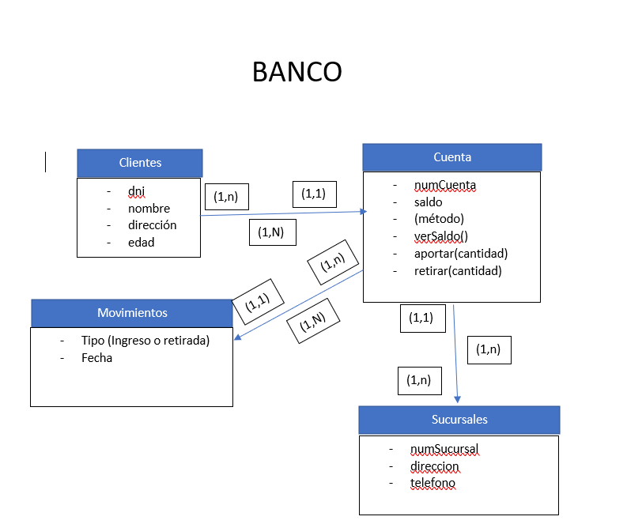
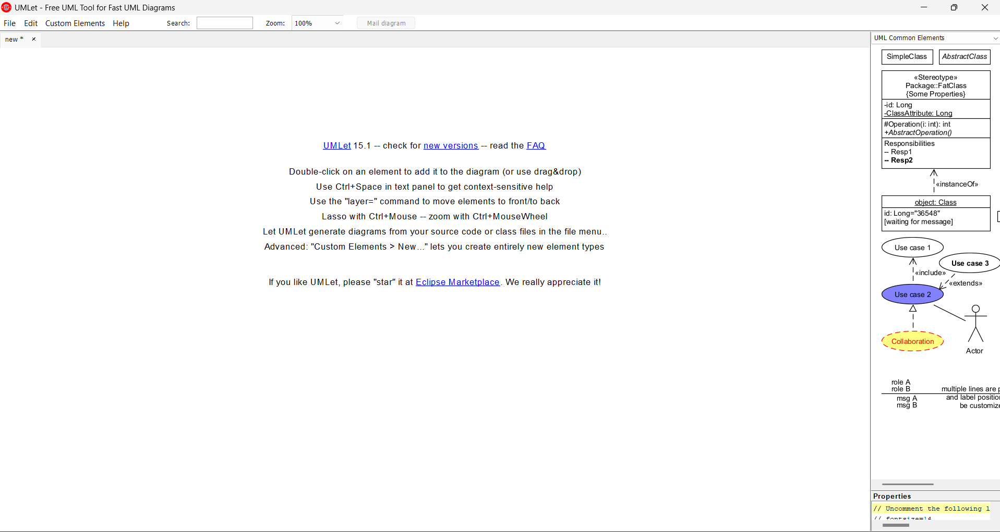
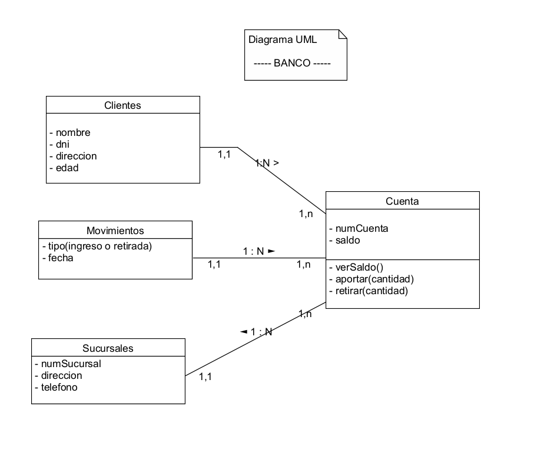

## 1 Ejercicio a resolver de UML
Este es mi diagrama UML (Hecho en word antes de investigar un programa para trabajar UML)

## Ejercicio2: Buscar un programa para trabajar con UML

Investigando, he encontrado el programa UMLet, se trata de un programa que nos permite hacer tanto diagramas UML como diagramas de flujo para nuestros programas que trabajamos o creamos dia a dia, como podemos observar en la imagen a continuacion a la izquierda, tenemos herramientas UML que nos permite, crear las clases e incluir sus metodos y atributos dentro, nos pone tambien lineas con cardinalidades para definir la cardinalidad de la relacion entre una clase y otra, escribir notas sobre el programa para el propio diagrama... en mi opinion, este programa está muy completo.

A continuacion, en la imagen siguiente, podemos observar las herramientas de este programa que he usado, para recrear el diagrama que he hecho en el ejercicio 1 en Word, pero como he dicho antes ahora en UML

como podemos ver en esta imagen asi es como me ha quedado mi diagrama UML en UMLet, la verdad que se ve más limpio, y en mi opinion con las herramientas que proporciona el programa es mucho más facil y rápido que hacerlo por ejemplo en un word como lo hice previamente.

-- Realizado por Javier Muñoz Parra | 1º D.AW.