# | Punto 1 | IDEs Para Java |
## IntelliJ Idea: 

 - El primer Ide que he probado ha sido IntelliJ IDEA, que es un IDE orientado para usar JAVA, Sobre un código de prueba que he hecho, lo usaré para probar que puedo y que no puedo hacer con este ide, a la hora de usar el debugger, git y plugins:

    - 1. Plugins
    Para este apartado es algo complicado ya que hay que buscarlo, tendriamos que irnos al apartado de archivo > opciones > plugins, y podremos ver una gran tienda de plugins, entre ellos un plugin que se llama AWS Toolkit. 

    - 2.En cuanto a git, tenemos o bien una terminal para escribir los comandos necesarios para llevar nuestro control de versiones, seria clicar en el iconito marcado en azul y se nos abriria la terminal, como podemos ver en la imagen a continuación:

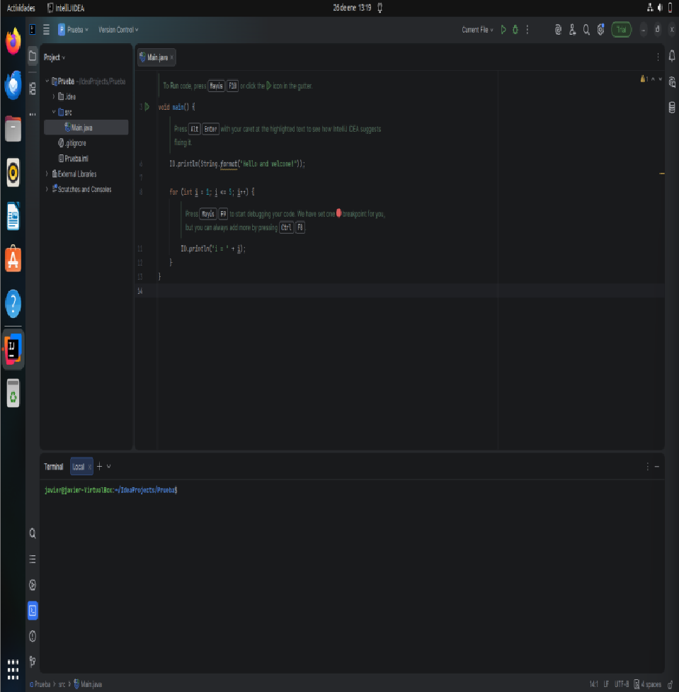

    o si se prefiere una viersion más "Sencilla", tenemos un apartado que pone "Version Control" en español control de versiones, pero habria que iniciar sesion

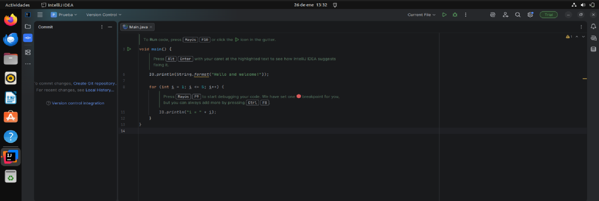

    - 3. Debugger: 
    Para usar el debugger, aqui es más facil que en vscode, para añadir un breakpoint usamos el clic derecho en la linea que queremos que el programa se detenga y le daremos o bien en la flechita que tenemos al lado de la lina de "void main", o arriba a la derecha en el simbolito del bichito

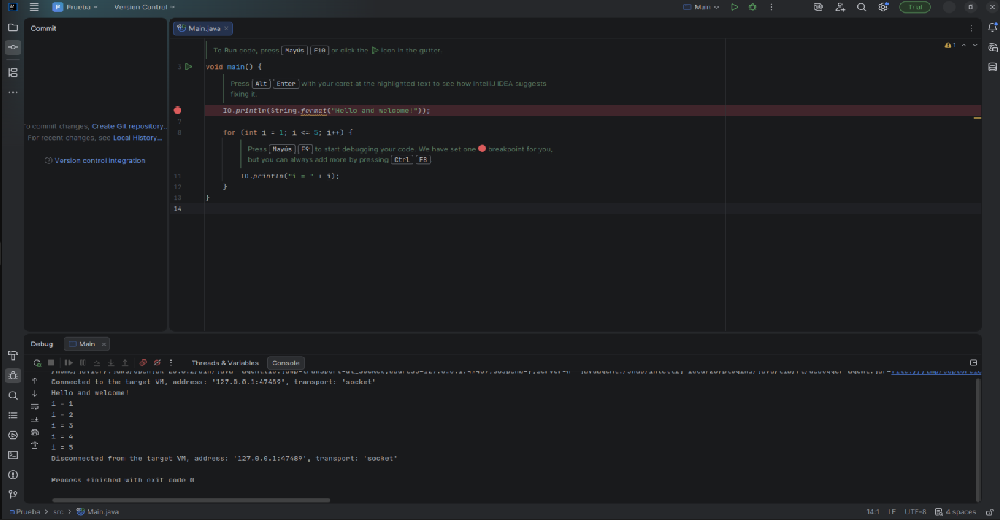

### Eclipse :

    - 1. Plugins:
    Para los pluggins, tendremos que seguir la siguiente ruta: help > Eclipse MarketPlace, una vez ahí nos saldra una lista con los plugins para elegir el que queramos instalar 
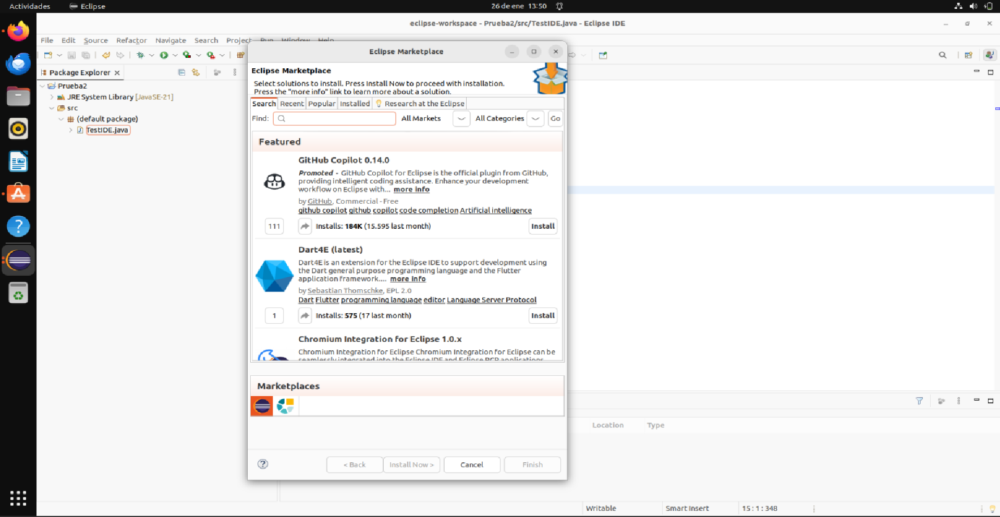

    2. Git: 
    Para el trabajo con git, es decir, control de versiones en este IDE, tendremos que irnos a Window > open perspective > other > git una vez hecho esto y elegido GIT, se nos abre en la parte inferior un apartado en el que nos salen, los archivos que tienen cambios NO guardados, archivos con cambios, y para hacer un commit, o commit y push al repo.
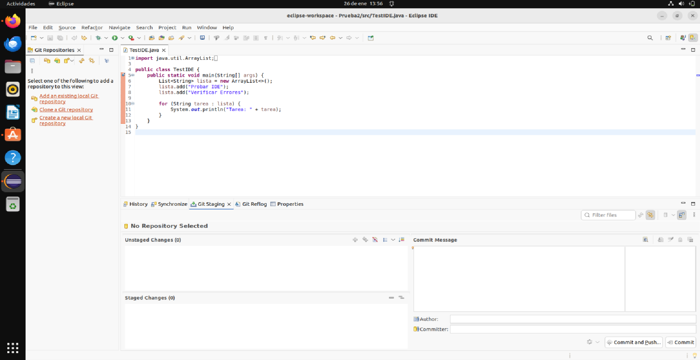

    3. Debugger:
    Para trabajar con Debugger, aqui es algo más rebuscado para los breakpoints ya que tenemos que posicionarnos sobre la linea, clic derecho "ADD breakpoint" y entonces se nos pondra un circulito azul, y para el debugger le dariamos simplemente al 6to icono que es un bichito, empezando por la izquierda:
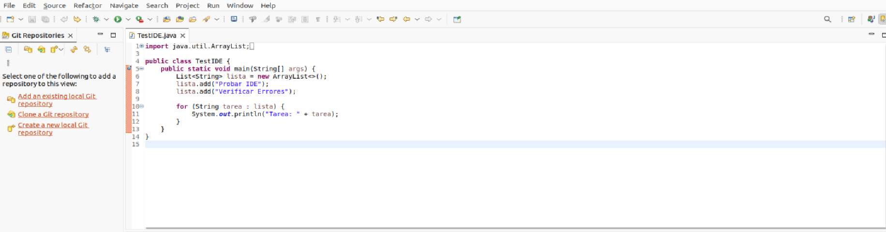

### BlueJ

    1. Plugins
    No tiene opcion para instalar plugins

    2. Git  
    No se puede trabajar con git mediante el programa, se tendria que usar mediante terminal

    3. Debugger
    Aunque tiene opcion de breakpoint, no tiene opcion de debuggear el programa, por lo que no le veo gran sentido

# | Punto 2 | Python

### PyCharm

1. Plugins:

    Este IDE, es muy parecido a Intellij Idea, empezando por este apartado el de los plugins, es en el mismo lugar que Intellij, en el apartado de configuración bajamos al apartado que pone plugins y encontraremos su gran catalogo de plugins para instalar los que necesitemos o queramos.

    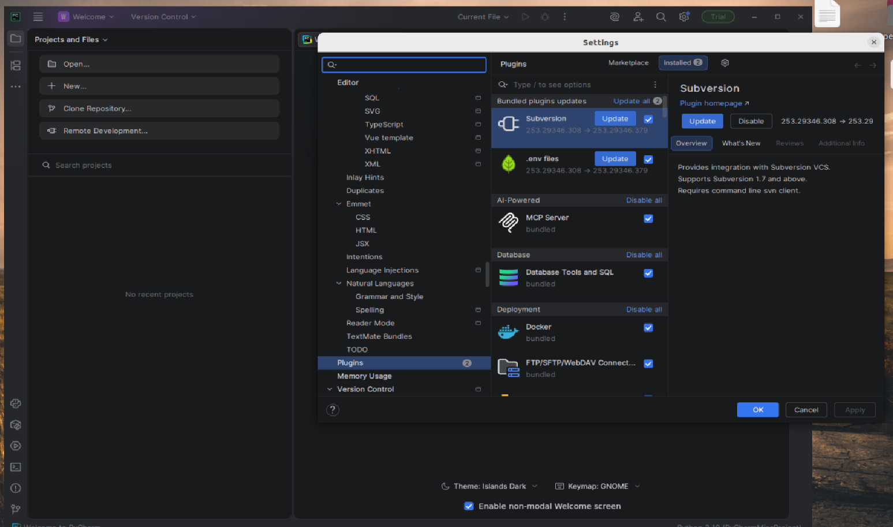

2. Git:
    En cuanto a la hora de trabajar con git, lo mismo tenemos nuestra querida terminal abajo a la izquierda, o si bien queremos un entorno grafico, ya que puede ser que el que este programando no le gustan los comandos, podemos usar que este caso si al darle a version control elegimos local, nos deja trabajar en las ramas que queramos y eligiendo el archivo que queramos como podemos observar en la segunda imagen y en la cajita de abajo escribir lo que necesitemos en el commit.

    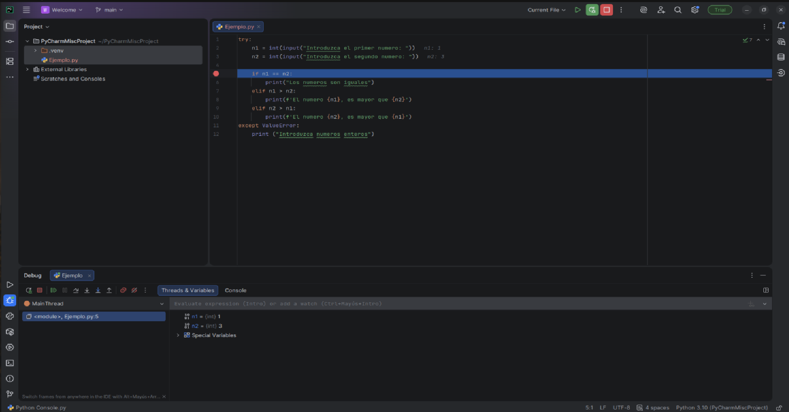

3. Debugger

    A la hora de trabakar con el Debugger y breakpoints, es lo mismo que con intelliJ, situamos el breakpoint donde queramos y abajo a la izquerda debajo del simbolito de play le damos al bichito y a ejecutar, nos dice que tenemos en las variables y pudiendo ejecutar el codigo LINEA a LINEA a nuestra disposicion
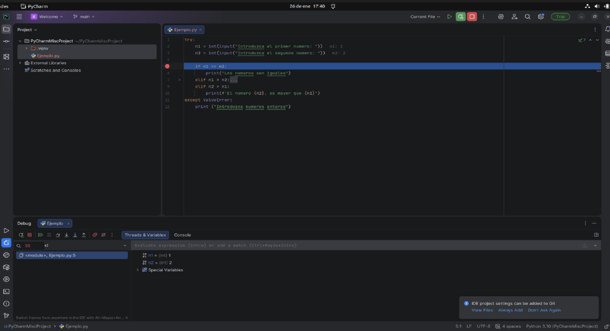

### Thonny

1. Plugins: 

    Aunque este programa esta orientado para aprender programacion, en este caso python, se le pueden instalar plugins mediante usando el apartado "Herramientas" dentro de ese menu seleccionando el apartado de administrar plugins e instalamos el que necesitemos o más nos guste

    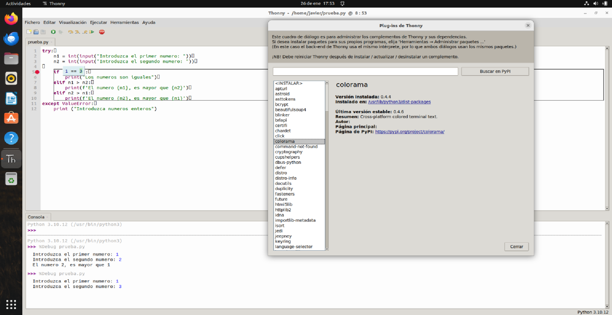

2. Git: 

    A al hora de trabajar con git en thonny, por desgracia no se puede llevar un control de versiones de la app, pero se podria con un plugin o usar la propia terminal de tu dispositivo, lo cual aunque es muy potente esta herramienta, no tiene esta funcion, la cual la haria más potente en mi opinion.

3. Debugger: 

    En cuanto al debugger más de lo mismo que con los otros programas pero este tiene una prqueña diferencia, y es que las variables te las pone, en las propias lineas de codigo como podemos apreciar en la siguiente imagen, por otro lado los breakpoints, se usan de la misma manera que en los otros programas.

    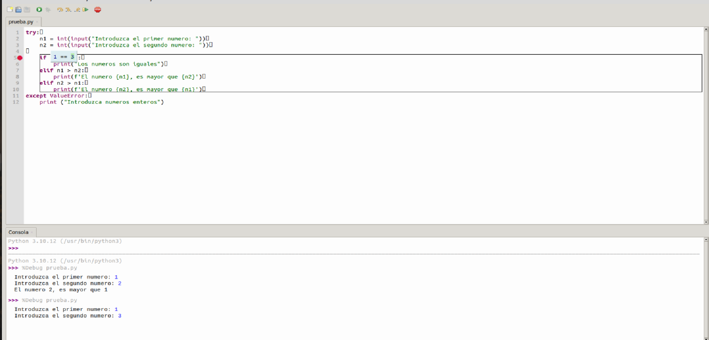

    Realizado Por: Javier Muñoz Parra | 1º DAW