## CONEXION SSH A VM LINUX DE AWS

- Acceso al laboratorio de aws:
1. Lo primero que he hecho ha sido, he entrado en el modulo2 de aws de la asignatura, y he bajado al apartado que dice `Launch AWS learner lab` como podemos ver en la siguiente imagen:

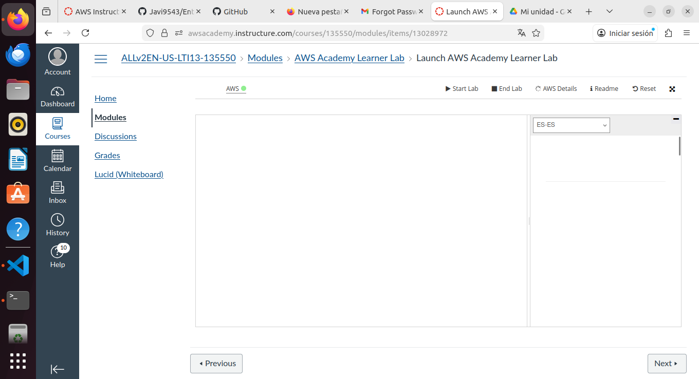

2. Una vez he accedido a mi laboratorio de aws, espero a que el puntito rojo se me ponga verde, una vez he presionado el boton `Start`

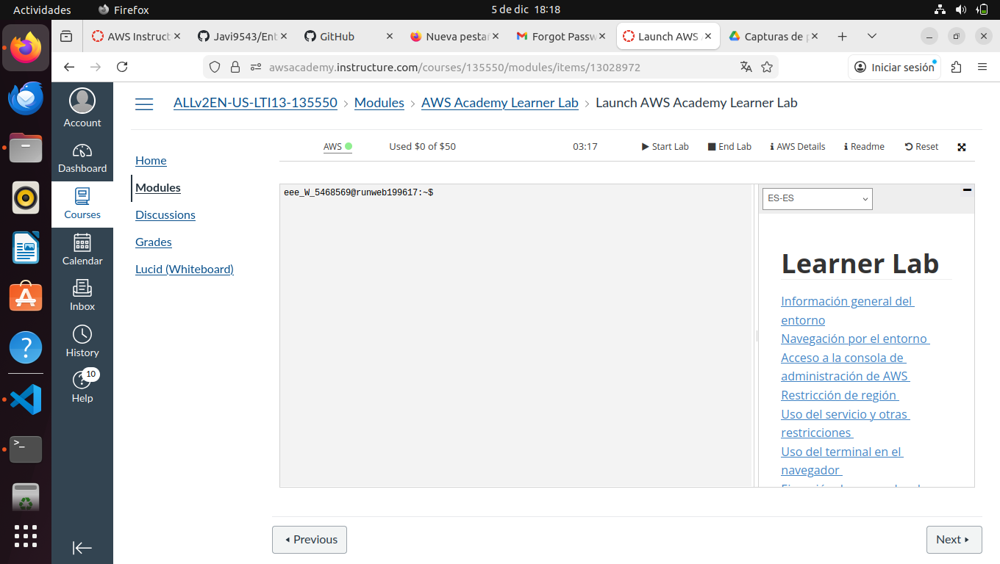

3. Ahora le pincho al boton verde donde pone `AWS`, y accedo a una especie de menú principal del laboratorio de aws como podemos ver en la siguiente imagen: 

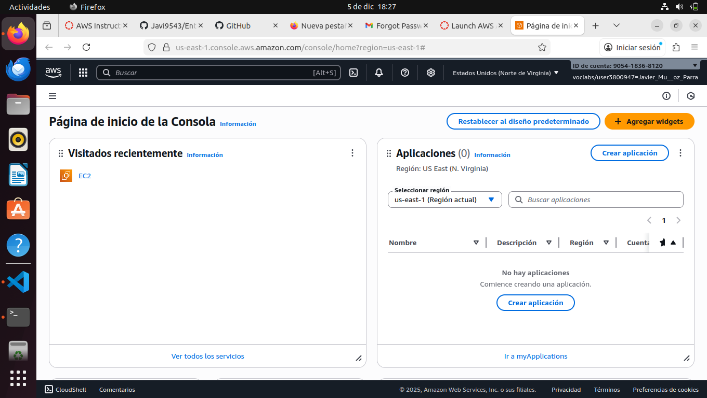

4. Una vez estoy en el menu principal de AWS, accedo a EC2 (lo he preparado antes), en el menú lateral pincho en la opcion`Instancias` como vemos en la imagen siguiente, y le doy a lanzar instancia:

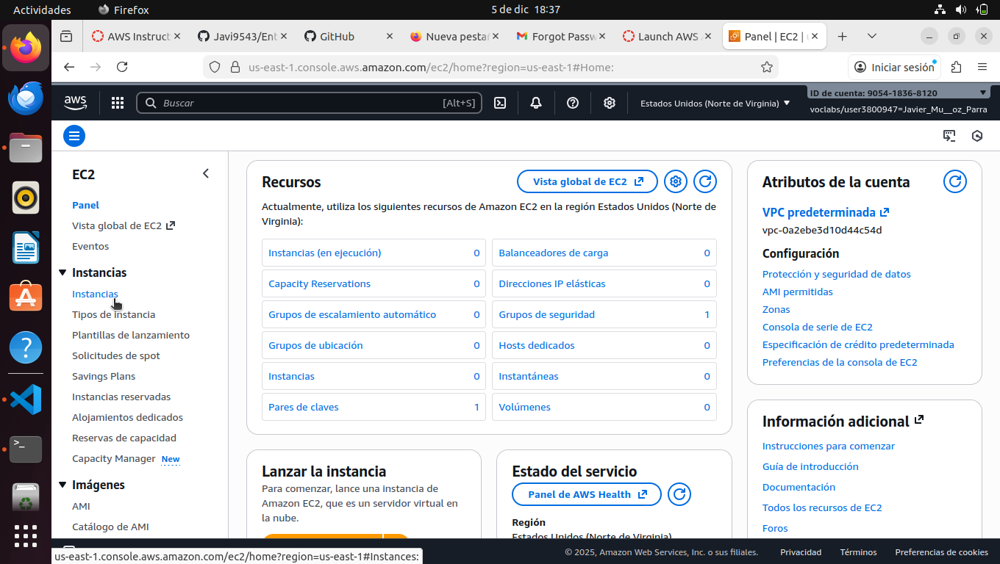

5. ahora la configuro poniendole un nombre, y en este caso le pongo el S.O ubuntu y el siguiente nombre a la innstancia: 

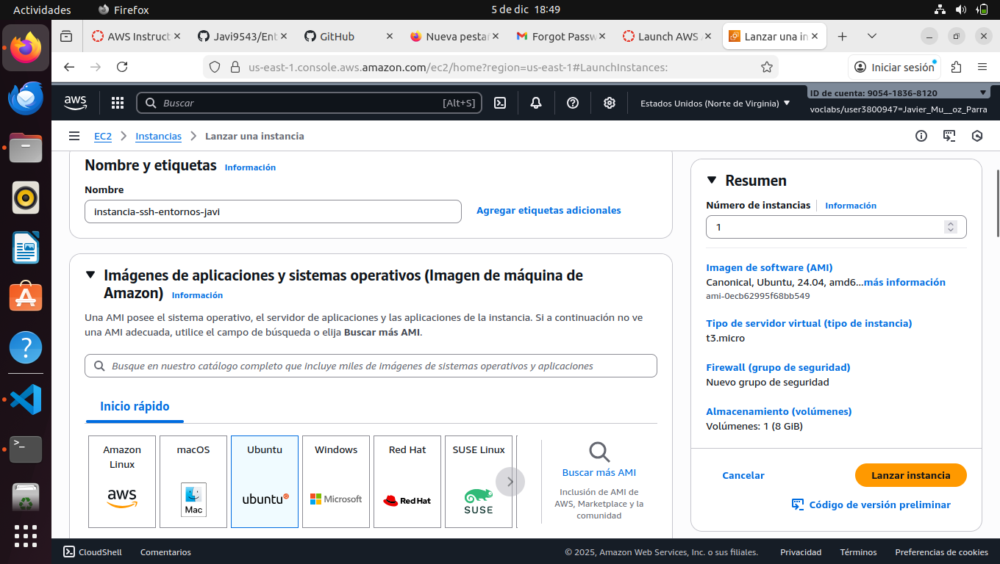

5.1 Selecciono por ultimo el par de claves vockey y le doy a lanzar instancia: 
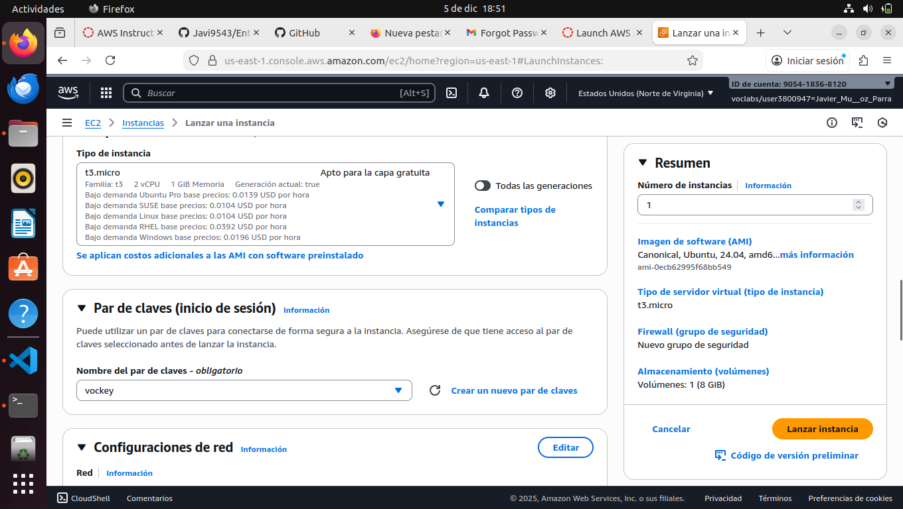

## CONEXION A LA MV DE UBUNTU DE AWS MEDIANTE SSH:

1. Lo primero que hago aqui es clickar en la opción `conectarse a instancia` la cual me lleva otra página que me da las credenciales para conectarme por ssh, en mi caso lo haré por la terminal: 

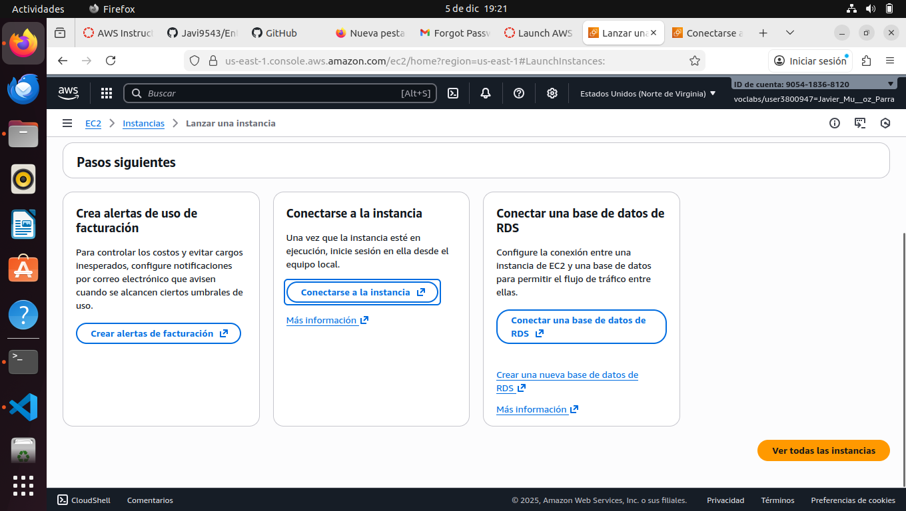

En la siguiente imagen podemos observar que estoy en el apartado de ssh donde me da una serie de comandos e instrucciones para conectarme por una **TERMINAL** de comandos, en mi caso usaré la de mi ubuntu los cuales me conectare por ip:
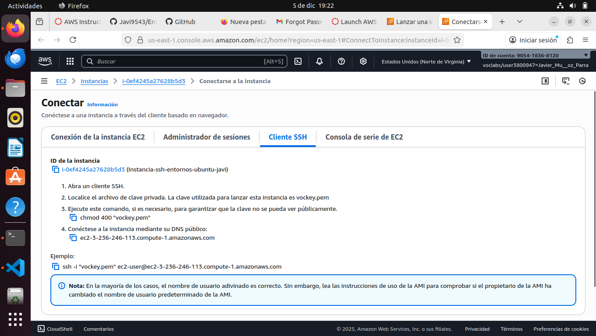

Como podemos ver en la imagen a continuación podemos observar que no me deja conectarme a la maquina virtual por ssh, debido a permisos, por lo que usare un chmod 600 labuser.pem, y volveré a intentar conectarme

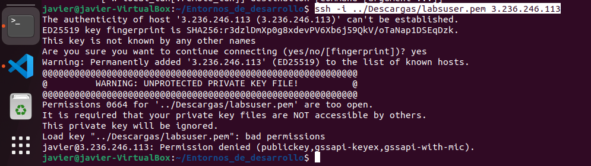

*Debido a varias pruebas fallidas, he acabadando la dir.ip dns para conectarme a la mv como podemos ver en la siguiente imagen*

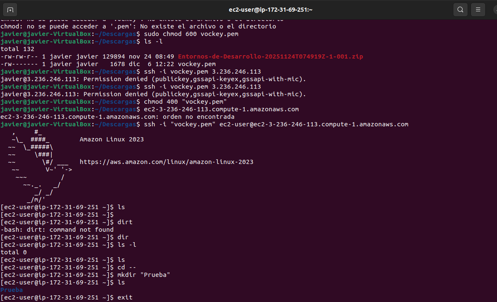 
- Aqui he creado una carpeta como prueba para que se vea que estoy conectado a la mv de amazon.

## 2DA Forma de conexion la VM: 
La segunda forma de conexion y más facil, es que si en el apartado de conexion, nos quedamos en el apartado de `Conexion Instancia EC2`, lo dejo todo y le doy a conectar

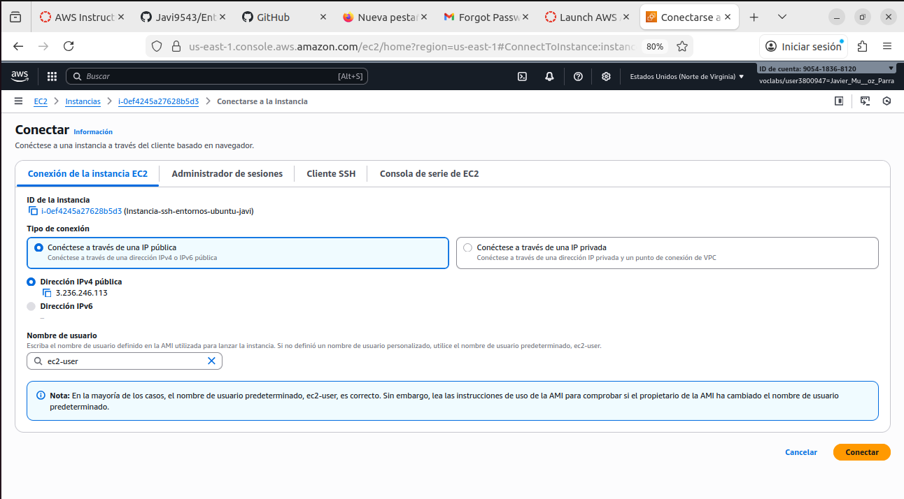

Y ya como podemos ver en la siguiente imagen, podemos ver que al hacer un ls del directorio en el que estoy, tengo el directorio prueba creado previamente desde mi terminal local de mi ubuntu.

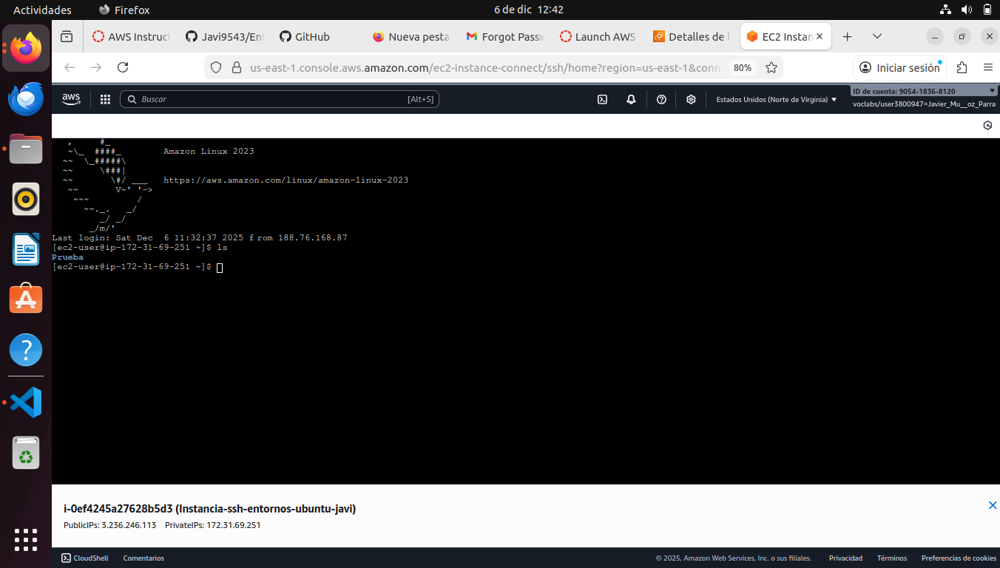

-----
`Realizado Por: Javier Muñoz Parra | 1º DAW | I.E.S ILIBERIS`
